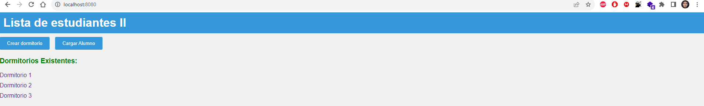
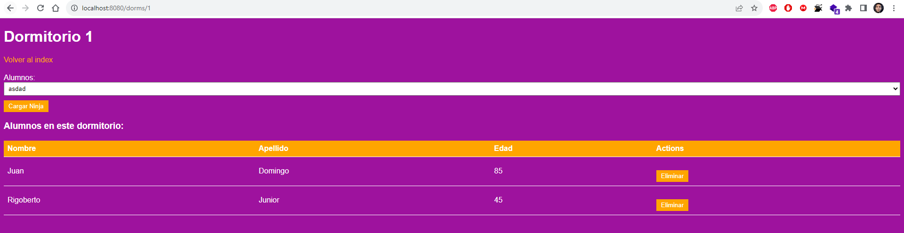
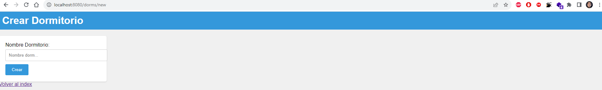
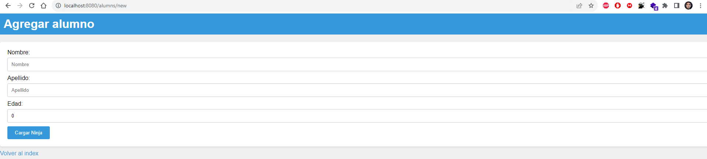

# APP monolítica Lista de estudiantes - Coding Dojo Spring Data II

### Consta de dos tablas con relación one to many, se cargan alumnos y dormitorios y en otra instancia se le asignan los dormitorios a los alumnos, se pueden desvincular tambien.

### Características

- Relación entre dos tablas en la base de datos SQL.
- Realizado con MVC con Thymeleaf.

  
  
  
  

